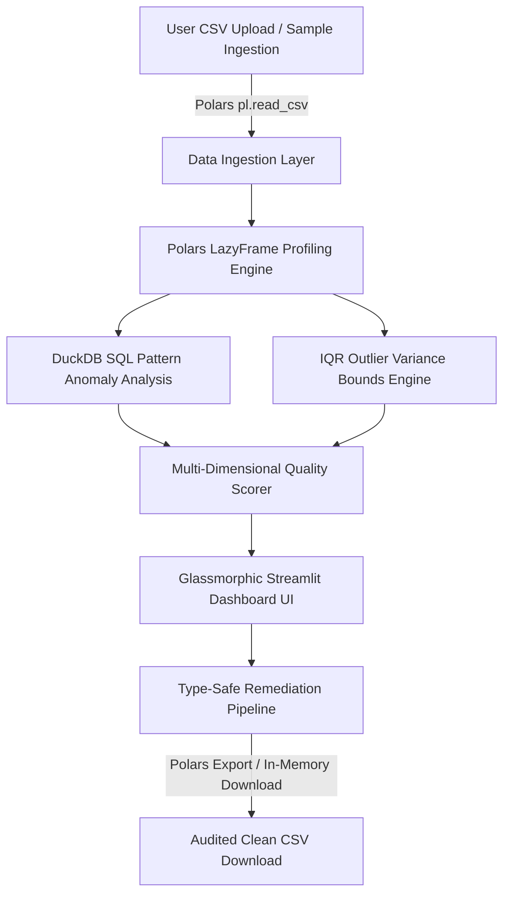

# 🛡️ Data Quality Auditor

[](https://github.com/Ali-datasmith/Data-Quality-Auditor/actions/workflows/ci.yml)
[](https://github.com/Ali-datasmith/Data-Quality-Auditor/actions/workflows/ci.yml)
[](https://www.python.org/)
[](https://pypolars.org/)
[](LICENSE)

An enterprise-grade B2B Streamlit web application engineered for real-time automated data quality audits, statistical profiling, anomaly detection, and automated remediation pipelines. Powered by modern Python 3.12+ tooling, Polars lazy evaluation, DuckDB SQL pattern checks, and Argon2id security authentication.

---

## 🌟 Key Features

* **⚡ Fast Data Ingestion & Lazy Evaluation:** Ingests CSV datasets using Polars (`pl.read_csv`, `pl.scan_csv`, `pl.LazyFrame`) for fast parsing and low-memory statistical profiling.
* **🔐 Enterprise Argon2 Authentication:** Secure password hashing using `argon2-cffi` (`Argon2id` with key-stretched PBKDF2 fallback) and a **1-Click Recruiter Demo Access** bypass button.
* **📊 Multi-Dimensional Data Quality Scoring (0–100):** Algorithmic scoring model assessing completeness, uniqueness, type consistency, outlier rates, and a single dataset-level duplicate penalty.
* **🔎 DuckDB Pattern Anomaly Detection:** In-memory SQL pattern checks verifying regex emails, multi-format timestamps, and string/numeric pattern mismatches.
* **🛠️ Automated Data Remediation:** Type-safe missing value imputation, IQR variance outlier clamping, duplicate row purging, mutation change-log tracking, and clean CSV export.
* **🛡️ Production Quality Gates:** Type-hinted under Python 3.12+ syntax, verified with `mypy`, linted via `ruff`, and validated via `pytest` (26 test cases).

---

## 🏛️ Architecture Overview



---

## 📊 Data Quality Scoring Model

The dataset quality index (0–100) evaluates statistical metrics against configurable weights defined in `config.toml`:

| Metric Dimension | Default Weight | Assessment Logic & Calculation |
| :--- | :---: | :--- |
| **Completeness** | **40%** | `100 - (missing_count / total_rows * 100)`. Penalizes blank or null fields. |
| **Uniqueness** | **20%** | Context-aware cardinality ratio (`null_excluded_unique_count / total_rows`). Evaluates value distribution for categorical vs ID fields. |
| **Type Consistency** | **20%** | Evaluates DuckDB structural type mismatches (`100 - mismatch_pct * 2.5`). |
| **Outlier Rate** | **20%** | Calculates values outside IQR fences `[Q25 - k*IQR, Q75 + k*IQR]` using nearest quantile interpolation for numeric columns (`100 - outlier_pct * 3.0`). Non-numeric/boolean columns exclude this factor and renormalize weights across remaining dimensions. |
| **Dataset Duplicate Penalty** | **Deduction** | Applied **once** at the dataset level (`min(20.0, duplicate_pct * 0.5)`). |

Grade thresholds are loaded dynamically from `config.toml` (`[grades]`):
* **Excellent:** 85 – 100 (Green)
* **Good:** 70 – 84 (Blue)
* **Fair:** 50 – 69 (Yellow)
* **Poor:** 30 – 49 (Orange)
* **Critical:** 0 – 29 (Red)

---

## 🛠️ Automated Remediation Behavior

The remediation pipeline applies type-safe cleaning rules via Polars lazy expressions:

* **Numeric Columns:** Imputes missing values using median. If a numeric column is entirely null, falls back deterministically to integer `0` or float `0.0`.
* **Boolean Columns:** Imputes missing values with `False`.
* **String Columns:** Imputes missing values with `"Unknown"`.
* **Temporal Columns:** Missing value imputation is intentionally skipped for date/timestamp columns to prevent corrupting timeline sequences.
* **IQR Outlier Clamping:** Clamps numeric outliers strictly inside lower and upper IQR fence boundaries.
* **Duplicate Removal:** Purges duplicate rows based on full-row context or user-selected column subsets while preserving internal collision-safe audit row identity (`__dq_audit_row_id_<uuid>__`).
* **Change-Log Tracking:** Computes mutually exclusive mutation counts (`null -> value`, `value -> different value`, `value -> null`) and dropped row counts.
* **Clean CSV Export:** Exports clean UTF-8 CSV bytes in-memory for Streamlit download, while providing `sink_cleaned_csv()` for batch/streaming disk exports.

---

## 📂 Repository Directory Layout

```
📁 Data-Quality-Auditor
 ├── app.py                   # Streamlit entry point & session orchestration
 ├── credentials.py           # Argon2id authentication & recruiter bypass logic
 ├── config.toml              # Scoring weights, IQR multipliers, and grade thresholds
 ├── runtime.txt              # Streamlit Cloud Python 3.12 environment spec
 ├── pyproject.toml           # Ruff & Pytest configuration settings
 ├── requirements.txt         # Production dependencies
 ├── LICENSE                  # MIT License file
 ├── conftest.py              # Pytest environment path configuration
 ├── src/
 │    ├── core/               # Statistical profiler, scorer & DuckDB anomaly engine
 │    ├── ui/                 # Streamlit UI panels (Dashboard, Charts, Login, Report Cards)
 │    └── utils/              # Polars lazy data cleaner & remediation exporter
 ├── data/                    # Sample dataset (sample_messy.csv)
 └── tests/                   # Automated pytest suite (26 test cases)
```

---

## 🚀 Local Setup & Installation

### Prerequisites
* Python 3.12 or higher
* Git

### Step-by-Step Instructions

1. **Clone the repository:**
   ```bash
   git clone https://github.com/Ali-datasmith/Data-Quality-Auditor.git
   cd Data-Quality-Auditor
   ```

2. **Create and activate a virtual environment:**
   ```bash
   python3 -m venv venv
   source venv/bin/activate
   ```

3. **Install dependencies:**
   ```bash
   pip install -r requirements.txt
   pip install ruff mypy pytest argon2-cffi
   ```

4. **Run the application:**
   ```bash
   streamlit run app.py
   ```

---

## 🧪 Testing & Quality Checks

Run local static analysis and unit tests:

```bash
# Run pytest test suite (26 tests)
python3 -m pytest

# Run Ruff linter
ruff check .

# Run Mypy static type checker
mypy --ignore-missing-imports app.py credentials.py src/ tests/
```

---

## ⚙️ Configuration Reference

Operational thresholds, default duplicate scope, and scoring weights are defined in `config.toml`:

```toml
[scoring]
completeness_weight = 0.40
uniqueness_weight = 0.20
consistency_weight = 0.20
outlier_weight = 0.20

[detection]
outlier_iqr_multiplier = 1.5
duplicate_subset = "all"
max_upload_mb = 200

[grades]
excellent = 85
good = 70
fair = 50
poor = 30
```

---

## 🔐 Authentication & Recruiter Demo Access

* **Standard Auth:** Authenticates against Argon2id salted password hashes (`credentials.py`).
* **1-Click Recruiter Demo Access:** A prominent button on the login screen (`⚡ 1-CLICK RECRUITER DEMO ACCESS`) allows instant authentication as `"Recruiter-Demo"` without typing credentials.
* **Session Management:** Full session isolation with explicit logout support.

---

## ☁️ Deployment Notes

This application is ready for deployment on **Streamlit Community Cloud**:
1. Connect repository to Streamlit Cloud.
2. Select `app.py` as main file path.
3. Streamlit Cloud automatically uses `runtime.txt` (Python 3.12) and installs `requirements.txt`.

---

## 📜 License

Distributed under the [MIT License](LICENSE). Copyright (c) 2026 Ali Datasmith.
